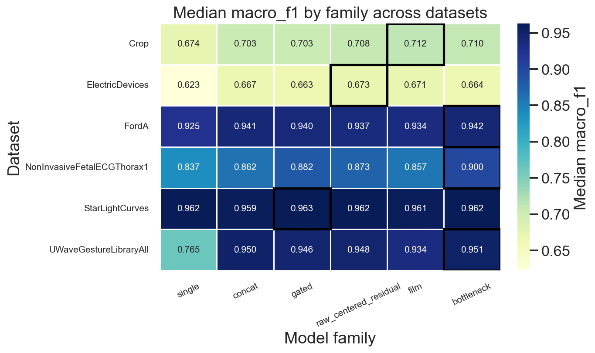
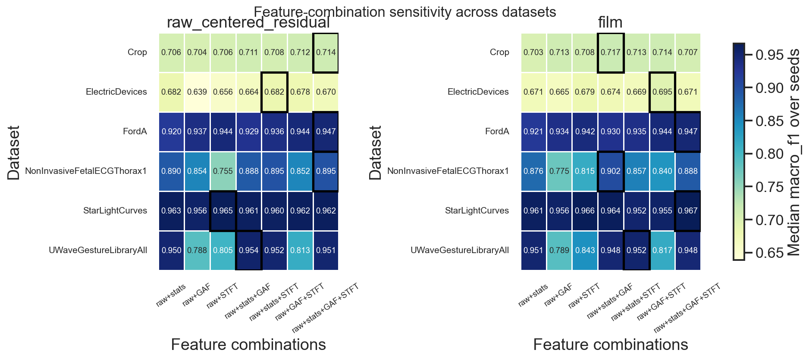
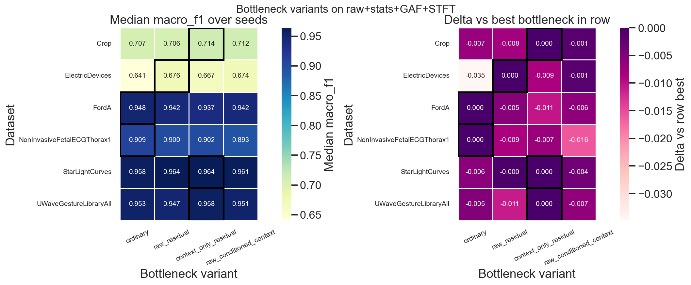

# FUTURE

**Fusion-based Unified Time-series Representation Encoder**

Multimodal representation learning and classification for time series.

## Project Description

This repository contains materials related to a research project focused on developing a method for automated representation learning of time series using features from different modalities.

The project explores the construction of a multimodal time series representation that combines information from the original signal, statistical characteristics, and alternative transformations of the series. The main idea of the research is to improve time series analysis by jointly using different data representations and integrating them into a unified model.

The project is aimed at studying time series classification approaches, comparing individual modalities, evaluating the effectiveness of multimodal fusion, and analyzing the contribution of different feature types to the final model performance.

## Modalities

Each sample can be represented in several complementary views:

| Modality | Description |
|----------|-------------|
| **raw** | Original multivariate time series, encoded with a 1D CNN |
| **stats** | Hand-crafted statistical descriptors (windowed + global features) |
| **gaf** | Gramian Angular Field image |
| **stft** | Short-time Fourier spectrogram |

## Repository Structure

```
src/
  data/                 # UCR/UEA loading (load_dataset)
  models/               # Encoders, fusion modules, multimodal classifiers
  representations/      # GAF, MTF, STFT, statistical, recurrence features
  metrics/
  tools/

experiments/
  fusion_over_raw_experiment.py
  image_transformations_benchmark.py
  agregate_results.py
  configs/fusion_over_raw.json
  visualization/

tests/
results/
```

## Quickstart

Install dependencies first (see [Requirements](#requirements)), then from the repository root:

**Main experiment** — run the full fusion-over-raw grid (config: [`experiments/configs/fusion_over_raw.json`](experiments/configs/fusion_over_raw.json)):

```bash
python -m experiments.fusion_over_raw_experiment
```

Subset of datasets / seeds, skip completed runs:

```bash
python -m experiments.fusion_over_raw_experiment \
  --config experiments/configs/fusion_over_raw.json \
  --output-dir results/fusion_over_raw \
  --datasets FordA Crop \
  --seeds 42 \
  --skip-existing
```

**Aggregate results** and **regenerate plots**:

```bash
python -m experiments.agregate_results
python -m experiments.visualization.plot_family_stripplots
python -m experiments.visualization.plot_feature_combination_heatmaps
python -m experiments.visualization.plot_bottleneck_comparison
```

**Transformation benchmark** (GAF / MTF / STFT speed and correctness vs pyts/scipy):

```bash
python -m experiments.image_transformations_benchmark
```

**Tests:**

```bash
pytest
```

## Main Experiment: `fusion_over_raw`

### Research Questions

1. Does jointly using multiple time-series representations improve prediction quality?
2. For fusion models, does the best modality combination depend on the dataset?
3. Which fusion methods and modality combinations yield the largest quality gains?

**Scale:** 6 datasets × 38 configurations × 3 seeds = **684 runs**

**Configuration:** [`experiments/configs/fusion_over_raw.json`](experiments/configs/fusion_over_raw.json)

**Task:** multiclass time series classification.

**Metrics:** `accuracy`, `balanced_accuracy`, `macro_f1`, `weighted_f1`. **`macro_f1` is the primary metric** for comparing models and reporting deltas vs raw baselines.

**Data:** six UCR/UEA benchmarks, downloaded automatically via [`load_dataset`](src/data/download_data.py) (cached under `data/<DatasetName>/`):

- FordA
- ElectricDevices
- Crop
- StarLightCurves
- NonInvasiveFetalECGThorax1
- UWaveGestureLibraryAll

### Models Under Comparison

**Single-view baselines** — one modality only (`raw`, `raw_larger`, `stats`, `gaf`, `stft`).

**External baseline** — `minirocket_ridge` (MiniRocket features + Ridge on the raw series).

**Multimodal fusion** — raw combined with context modalities:

| Modality combination | Fusion methods |
|----------------------|----------------|
| raw+stats | concat, gated, raw_centered_residual, film |
| raw+gaf | concat, gated, raw_centered_residual, film |
| raw+stft | concat, gated, raw_centered_residual, film |
| raw+stats+gaf | concat, gated, raw_centered_residual, film |
| raw+stats+stft | concat, gated, raw_centered_residual, film |
| raw+gaf+stft | concat, gated, raw_centered_residual, film |
| raw+stats+gaf+stft | concat, gated, film, raw_centered_residual, ordinary_bottleneck, raw_residual_bottleneck, context_only_residual_bottleneck, raw_conditioned_context_bottleneck |

### Results

All experiment artifacts are under [`results/fusion_over_raw/`](results/fusion_over_raw/):

- [`tables/`](results/fusion_over_raw/tables/) — `summary.csv`, per-run JSON results, and derived CSV/JSON tables from aggregation and plot scripts
- [`plots/`](results/fusion_over_raw/plots/) — figures (key heatmaps below)

Transformation benchmark outputs: `results/image_transformations_benchmarks/{boxplot.png, summary.csv, timings.csv}`

#### Model-family heatmap (median macro F1 across datasets)



**Takeaways:**

- Fusion combinations achieve higher metrics on average than single-modality models.
- **Concat** fusion did not improve quality on any dataset.
- The **bottleneck** family achieved the best results on 3 of 6 datasets.

#### Modality-combination sensitivity (`film`, `raw_centered_residual`)



**Takeaways:**

- Each dataset favors a different modality combination.
- Modality weights (or selection) should be adapted to the domain.

#### Bottleneck variants



**Takeaways:**

- **context_only_residual_bottleneck** performed best; **raw_residual_bottleneck** was slightly worse.
- **raw_conditioned_context_bottleneck** never ranked first on any dataset, but remained close to the leaders in quality.

## Requirements

- Python 3.10
- PyTorch, scikit-learn, pandas, matplotlib, seaborn, pyts, scipy, sktime

```bash
pip install -e .
```

Or with [uv](https://github.com/astral-sh/uv):

```bash
uv sync
```

UCR/UEA datasets are fetched on first use into `data/<DatasetName>/`.

## License

See [LICENSE](LICENSE).
